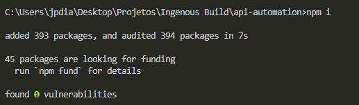
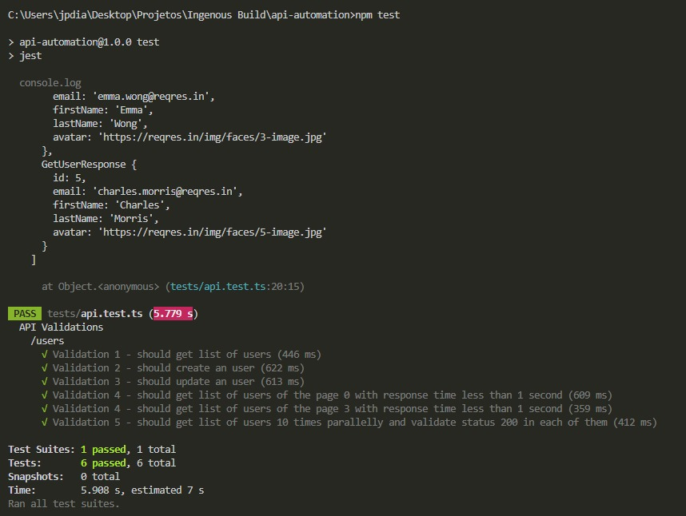

# API Challenge — Joao Paulo Dias
Hello, my name is Joao Paulo Dias and I did this challenge aiming to be your Senior QA Engineer. I love programming and testing, therefore I love to automate testing scenarios
## What the project is about and why the language and tools selected
This project is responsible for automating API testing on [Reqres.in](https://reqres.in/) using Typescript, Jest and Supertest. These three were selected because they can be easily implemented with npm supporting and some configurations and they are well-known frameworks, with recent updated and a large support community.

## How to set it up
I prepare a to-do list:

- Install Node JS with npm package [acessing here](https://nodejs.org/en/)
- Once installed, use your IDE to open the folder api-automation.
- Open the Terminal in the folder project, type ```npm i```

- With these steps done, we are ready to execute the tests.

## How to execute it
- Keeps in Terminal with the folder project opened and type ```npm test``` and you will see the tests running and logging informations that are requirements.

  
## How to develop for it
Develop for it is easy. Firstly, you will create a model that represents the request that you need to test in ```model``` folder. Then, you will annotate the class model as a ```@jsonObject```, it will allow you serialize and deserialize the class when it sends a request and get a response from the server. After it, you will have to add `` @jsonMember`` annotation on each of class attributes, it allows you to create a JSON with these attributes and you can set options like ``name`` of a member to surpass different naming conventions between API and project or the ``deserializer`` and ``serializer`` to use in the values of the attribute, allowing conversions. 

Concluding the model creation, you must create a builder class for models that you will send to API. Fluent Builder Pattern allows you to create testing data with default values and change them if it is necessary without repeat code. It avoids that enormous quantity of constructors during the test script and they facilitate the maintainability. So the scope of a fluent builder is:
- ``attributes`` that you will use in the class instance with default values, you can use Pure-Gen or other random data creator to set random values in them; 
- ``new()`` static method that is responsible for a singleton creation of the builder
- ``withAttributeName()`` instance method that is responsible for changing the value of the attribute when it is necessary.
- ``build()`` instance method that is responsible for create the object instance and return it to the caller. 

Hence, it is possible to create default objects values and other objects with different values as you need.

Next, you will be able to create a test.
- First step is create a ``{file}.test.ts`` that will contain the test set to be executed. 
- In the test, create a ``request`` instance imported from ``supertest`` passing the baseURL that will be used in the requests
- You will instantiate the ``serializers`` and ``deserializers`` that you will need in the body requests and responses. 
- Next, we create the jest ``describe`` block, it is used to join tests that have a common objective, which can be an endpoint, a funcionality, etc.
- Following, we create the jest ``test``, passing a title and an anonymous function that will be executed as the test method.
- Using the supertest request, we choose the resource that we want request and the http method related to it. 
- Finally, we use the jest ``expect`` to make assertions about the responses that we got.  
